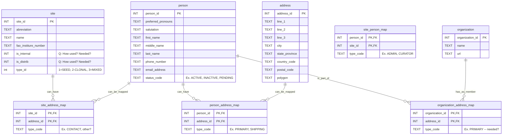

Proposed Coooperator table refactoring
-------------------------

Notes
-----
1. Assume that all tables will use whatever audit fields (created, owned, dates) are part of GRINext schema.
2. Associative tables assume a type_code field that describes the association -- ex., Rollo Tomasi linked to site NC7 as "CURATOR", Lisa Burke linked to site NC& as "ADMIN" (person with resp. for managing site curators and updating contact info)
3. User account/group/authorization tables intentionally omitted, given discussion of what authentication/auth mechanism will be used. Were we to retain existing tables, a person_sys_user_map table would connect person to sys_user.
4. One approach to implementation along the lines of expand-contract/parallel change could be an interim cooperator_person_map table, somewhat similar to code approach Cullen has devised. 

Questions/For Discussion
-------------------------
1. Some questions about person.status:
   a. Currently, status seems to be part of the workflow that's behind the duplication/over-storage of data: for instance, allowing coop records to be more or less soft-archived while allowing "research" into past orders to be linked to requestor info.. What is the policy behind retaining historical order information? How mucn of this information is needed for stats related to accessions per year/FY/etc.?
   b. If we need info such as "accessions by crop requested in the southwest US," for instance, there must be a way to store the location of the originator of the request without retaining "cooperator" info. A use for geo data/polygons?

